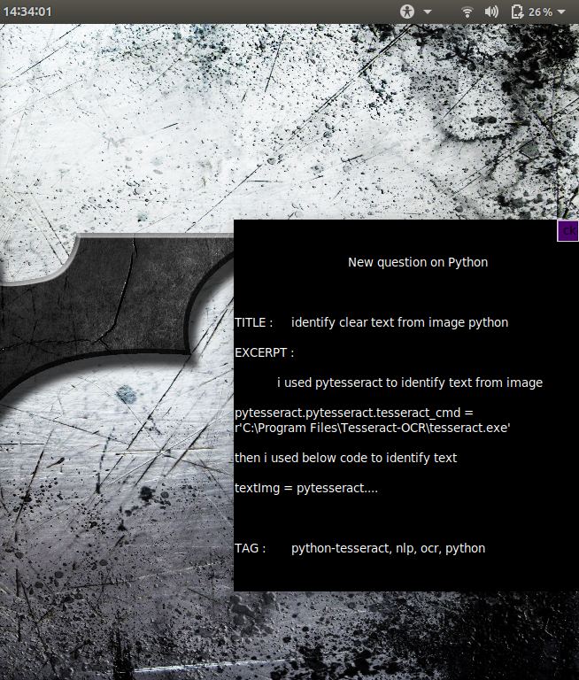

# Stackoverflow New Question Desktop Notifier
Automated Desktop notification about new questions being posted for a certain tag in stackoverflow for ubuntu system.

## Run instructions
Run in terminal `python3 scrape7.py`

## Dependencies
* requests
* bs4
* dlib
* tkinter
* webbrowser

## Sample Notification :
Here is one sample notification :

